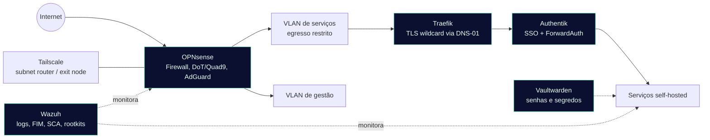

 

---

## 👋 Olá, eu sou o Lucas Lindemann Anschau do Amaral

🛸 Por aqui me chamam de **Agelinena** (*alienígena*), meu usuário em tudo.

🎓 Estudante de **Tecnologia em Segurança Cibernética** no **Senac RS** (conclusão prevista: 2029)

🛡️ **Estagiário de Segurança da Informação na AESC**: triagem de incidentes no CrowdStrike, segurança de e-mail com Trend AI, chamados de TI, relatórios gerenciais e palestras de conscientização

🏠 Mantenho um **homelab self-hosted** com foco em hardening e monitoramento contínuo

🎯 Buscando atuar em **Blue Team / SOC**, unindo análise de incidentes e automação

---

## 🧰 Tecnologias e ferramentas

| 🛡️ Segurança | 🌐 Infra e redes | 🐍 Automação | 🧪 Práticas |
|:--|:--|:--|:--|
| Wazuh (FIM, SCA, correlação) | Docker | Python (scripts, OOP) | Hardening de sistemas |
| OPNsense (Firewall, VLAN, DoT) | Linux | SQL (MySQL) | Segmentação de rede |
| CrowdStrike (EDR) | Traefik (proxy reverso, TLS) | n8n | Pentest web (OWASP) |
| Trend AI (e-mail) | Tailscale (VPN) | APIs e Webhooks | Gestão de chamados de TI |
| Authentik (SSO) e Vaultwarden | Git | | |

---

## 🗺️ Mapa do meu homelab

Diagrama interativo, com zoom e arraste no GitHub. Ajuste os nós conforme sua topologia real.

---

## 📂 Projetos em destaque

<b>🔥 Firewall e VPN (OPNsense)</b>

 

Regras de firewall, filtragem DNS com DoT/Quad9 e AdGuard, bloqueio anti-bypass e acesso remoto seguro via Tailscale (subnet router e exit node).

<b>🧱 Segmentação de rede</b>

 

Isolamento de tráfego em VLANs e redes internas por serviço, com políticas de egresso restritas e defesa em profundidade.

<b>🔒 Proxy e TLS (Traefik)</b>

 

Reverse proxy centralizado com certificados TLS wildcard automatizados (Let's Encrypt via DNS-01) e exposição seletiva de serviços.

<b>🪪 IAM e segredos (Authentik + Vaultwarden)</b>

 

SSO/IdP com ForwardAuth para proteger painéis administrativos e gerenciamento de senhas e segredos fora do versionamento.

<b>📡 SIEM e monitoramento (Wazuh)</b>

 

Agente para coleta de logs, correlação de eventos, monitoramento de integridade de arquivos (FIM), detecção de rootkits e avaliação de hardening (SCA).

<b>🛸 Easter egg</b>

 

Você achou o esconderijo do alienígena. Se quiser trocar ideia sobre SOC, homelab ou Blue Team, é só chamar.

---

## 📜 Certificações

- 🛡️ **Segurança de redes: firewall, WAF e SIEM**, Alura
- 🕷️ **Pentest: explorando vulnerabilidades em aplicações web**, Alura
- 💀 **Fundamental Hacking (60h)**, HackerSec

---

## 📊 Atividade no GitHub

---

## 📫 Como me encontrar

 

